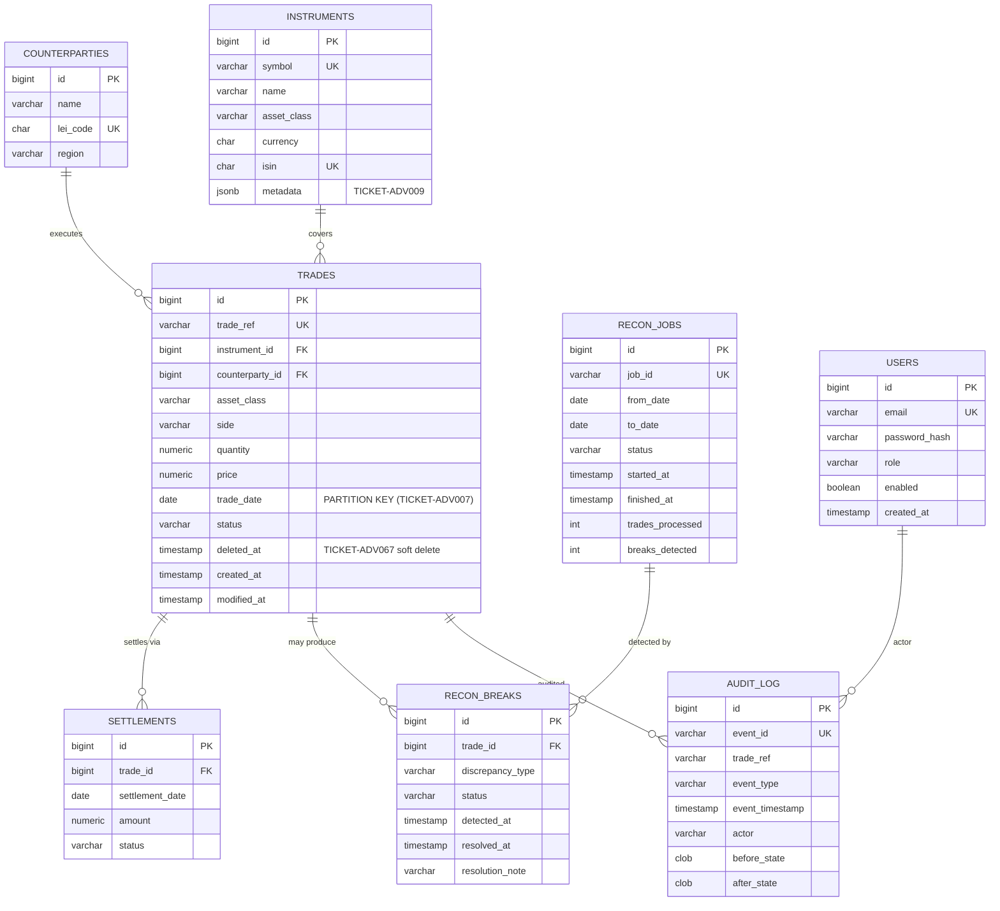

# ReconX Entity-Relationship Diagram (ERD)

This document defines the core 8-entity database schema for the **ReconX** platform. It serves as the primary reference for database partitioning (TICKET-ADV007), JSONB column structures (TICKET-ADV009), soft deletes (TICKET-ADV067), and foreign key join paths across services.

---

## ER Diagram (Mermaid)

---

## Entity Details & Special Annotations

1. **`TRADES`**:
   - **`trade_date`**: Partition key for range partitioning by date (`TICKET-ADV007`).
   - **`deleted_at`**: Supports soft-delete semantics (`TICKET-ADV067`).
2. **`INSTRUMENTS`**:
   - **`metadata`**: `jsonb` field indexed using GIN (`jsonb_path_ops`) for flexible containment queries (`TICKET-ADV009`).
3. **`AUDIT_LOG`**:
   - Tracks mutations across trade lifecycle events and user actions.